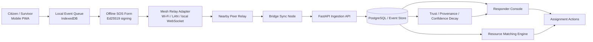
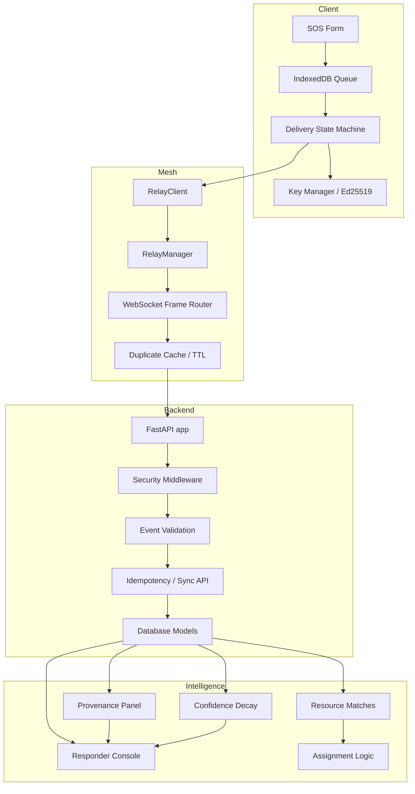
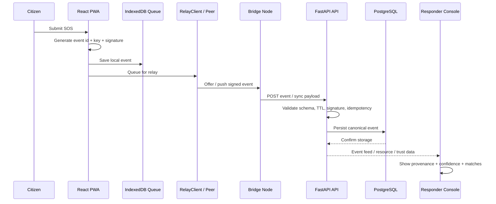
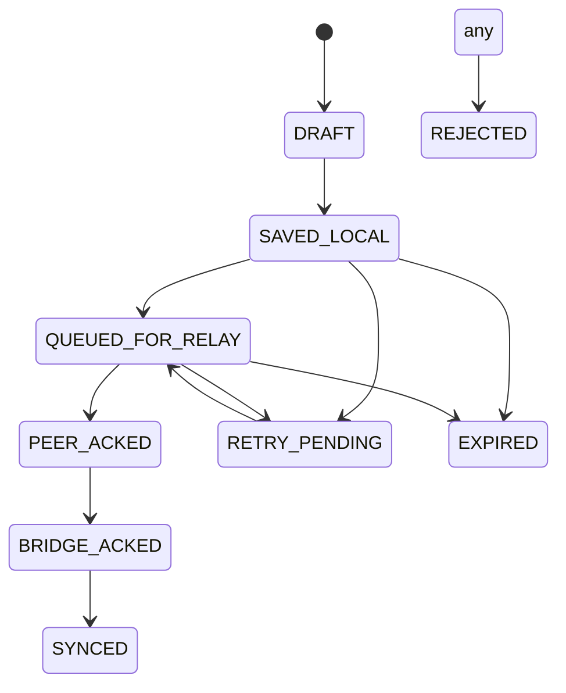
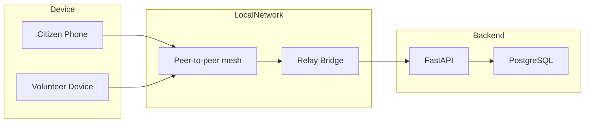

# ResQMesh Architecture

## 1. Project purpose

ResQMesh is an offline-first disaster coordination platform designed for situations where regular connectivity is unavailable or unreliable. The system allows a person to create an SOS locally, relay it through nearby peers, validate it at a bridge/API layer, and make it visible to responders with trust, provenance, and resource-matching information.

The current implementation is a prototype focused on the high-value path:

- Citizen creates SOS offline
- SOS persists locally in the browser
- Relay forwards the event through nearby peers
- Bridge sync sends it to the API
- Responder console surfaces the event
- Resource matches suggest relevant assets
- Provenance and confidence decay make uncertainty visible

---

## 2. Architecture summary

ResQMesh is split into five major layers:

1. Client layer: mobile-first React PWA for SOS creation and responder workflows
2. Mesh relay layer: local peer-to-peer transport using WebSocket/neighbor relay semantics
3. API + validation layer: FastAPI service with typed event validation and sync endpoints
4. Data layer: local queue storage and durable backend persistence
5. Coordination layer: responder evidence, resource matching, provenance, and assignment logic

The system is intentionally designed around event-first coordination, local-first storage, and bounded relay behavior so it can operate during outages without depending on a central service being available.

---

## 3. High-level system diagram

---

## 4. Component architecture

---

## 5. Core feature set

### 5.1 Offline SOS creation

The app allows a user to create a disaster request without requiring network connectivity.

Key aspects:

- Mobile-first SOS form
- Need code selection: medical, rescue, food/water, shelter
- Priority selection: critical, high, normal
- 6-character geohash input
- Local persistence in IndexedDB
- Generating a device key and signing the event with Ed25519
- State progression from draft to saved local to queued and synced

Relevant implementation area:

- apps/web/src/features/sos/SOSForm.tsx
- packages/contracts/types.ts
- apps/web/src/lib/crypto/ed25519.ts
- apps/web/src/lib/storage/queue.ts

### 5.2 Mesh relay and communication

Communication is designed to work in a disconnected environment using local peer relay channels.

Core functionality:

- WebSocket frame contract
- Event offer/request/push/ack flow
- Duplicate suppression
- TTL-based expiry
- Retry backoff
- Limited peer fan-out and hop count
- Prioritized delivery

Relevant areas:

- apps/web/src/features/relay/RelayClient.ts
- apps/web/src/lib/relay/frames.ts
- apps/web/src/lib/relay/dedupe.ts
- apps/web/src/lib/relay/quota.ts

### 5.3 API ingestion and synchronization

The backend validates, stores, and provides access to operational data.

Features include:

- FastAPI app startup + route registration
- Security middleware
- Event validation and schema checks
- Idempotent ingestion
- Event sync endpoints with cursor pagination
- Assignment and resource APIs

Relevant scope:

- apps/api/app/main.py
- apps/api/app/routes/*.py
- apps/api/app/services/*.py

### 5.4 Responder rollout and provenance

The responder console shows operational events with explanation rather than only raw data.

Included features:

- Event feed with paginated loading
- Provenance panel for origin, trust, relay hops, and freshness
- Signature state display
- Delivery state display
- Confidence decay for road observations
- Corroboration workflow

Relevant areas:

- apps/web/src/features/responder/ResponderConsole.tsx
- apps/web/src/features/responder/ProvenancePanel.tsx
- apps/web/src/features/responder/ConfidenceDecay.tsx

### 5.5 Resource matching and assignments

Resources are matched to SOS events using deterministic and explainable criteria.

The logic includes:

- need-to-capability mapping
- resource freshness check
- status filtering
- geohash proximity awareness
- reasoned rationale generation
- responder assignment creation

Relevant areas:

- apps/web/src/features/resources/ResourceMatches.tsx
- packages/contracts/types.ts
- apps/api/app/routes/resources.py
- apps/api/app/services/resource_service.py

### 5.6 Security and integrity controls

The project includes validation controls for the prototype security story.

This includes:

- Ed25519 signature generation and verification
- base64url encoded signatures
- schema version enforcement
- TTL expiry checks
- oversized payload rejection
- trusted event boundary for relay and bridge emissions
- server-side validation before canonical ingestion

Relevant tests:

- apps/api/tests/test_security_failures.py

---

## 6. Sequence: offline SOS to responder visibility

---

## 7. Delivery-state model

---

## 8. Data model overview

The canonical shared contract is defined in the TypeScript types. The design centers on immutable event envelopes and derived operational views.

### Event envelope

The system uses a signed event envelope carrying:

- schema version
- event id
- event type
- incident id
- created timestamp
- TTL
- priority
- origin metadata
- geohash
- payload
- signature

This allows a node to validate and relay without changing the underlying event body.

### Derived data

The app treats event records as the source of truth, and uses derived projections for:

- responder feed
- resource matching
- provenance
- trust state
- confidence decay
- assignment state

---

## 9. Deployment model

This is a prototype topology intended for local Wi-Fi and LAN scenarios rather than a full global cloud deployment.

---

## 10. Security and trust architecture

The current implementation follows a practical trust model:

- signatures protect integrity across hops
- API verifies events before ingesting them as canonical
- a public key is present but not treated as a verified identity by default
- provenance makes the source visible to responders
- trust scores are explainable rather than hidden black-box decisions
- confidence decay is intentionally visible to avoid unsafe certainty

This is a strong prototype boundary for an emergency system where data quality matters more than opaque automation.

---

## 11. Reliability and failure handling

The design specifically covers:

- offline save before network availability
- duplicate message suppression
- retry on bridge/API failure
- stale resource exclusion
- local queue semantics
- bounded relay traffic
- local degradation without full system shutdown

The architecture is built to fail safely and make data uncertainty explicit.

---

## 12. Implementation alignment with this repo

This repository already contains the core project pieces:

- frontend SOS flow in apps/web
- relay system in apps/web/src/features/relay and apps/web/src/lib/relay
- backend API in apps/api/app
- data contracts in packages/contracts/types.ts
- security validation tests in apps/api/tests/test_security_failures.py
- product design notes in docs/*

This architecture reflects that actual codebase rather than a detached generic architecture document.

---

## 13. Production evolution path

The current system is intentionally a prototype. The next production-grade evolution would include:

- encrypted transport and key registry
- durable bridge queueing and replay
- regional partitioning and custom read models
- stronger responder authorization
- more advanced geo and route systems
- staged rollout and larger observability pipeline

The goal is to keep the current version honest: it demonstrates the core mission path without claiming full emergency-grade production readiness.
