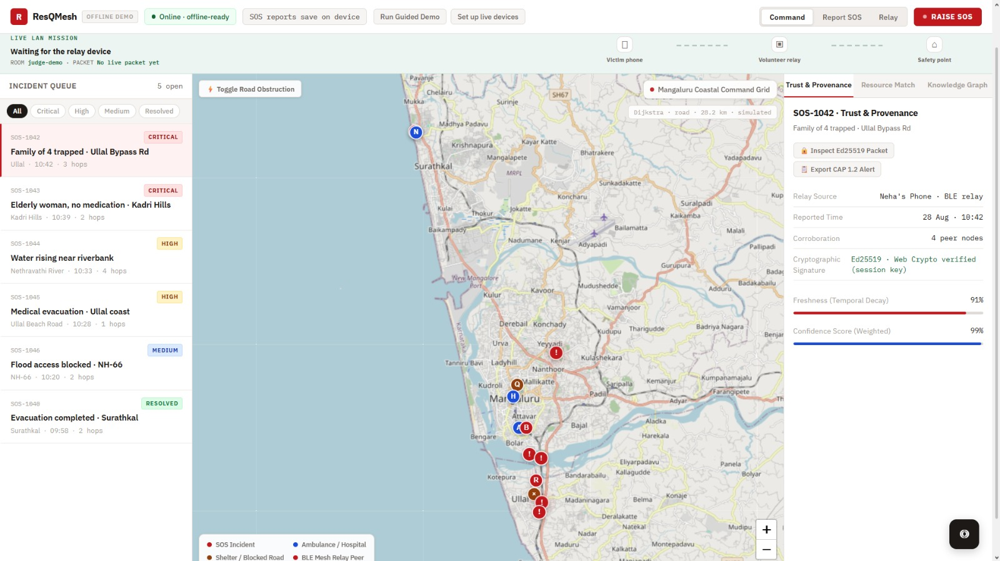
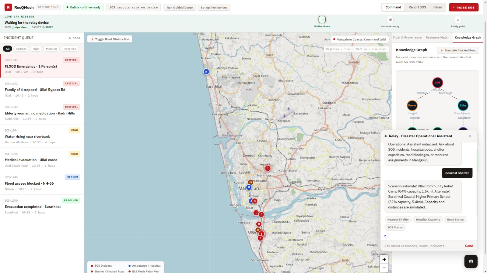
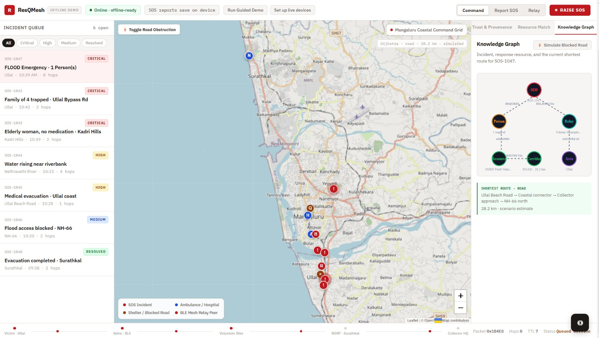
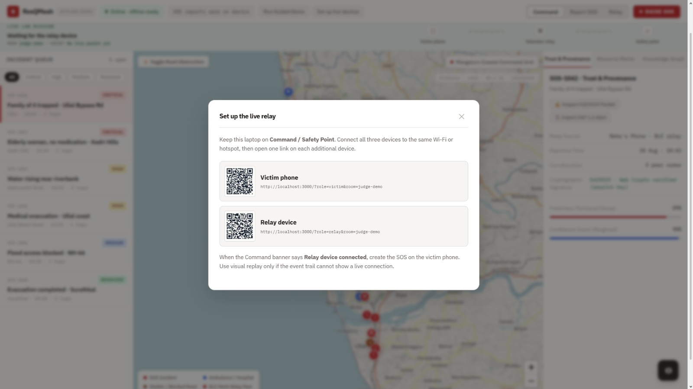

# 🚨 ResQMesh

### Disconnected-First Disaster Coordination Infrastructure

> **When cell towers go dark and the internet fails, ResQMesh keeps survivors connected.**

ResQMesh is a **disconnected-first disaster coordination platform** that enables smartphones, volunteers, and emergency vehicles to exchange critical information **without requiring continuous internet connectivity**.

It uses an **offline store-and-forward mesh architecture** to propagate SOS requests, road-condition reports, and resource availability until the data reaches a device with network connectivity.

---

## 🌊 The Problem

During severe **floods, cyclones, earthquakes, and other disasters**, communication infrastructure can become unavailable due to:

- Cell tower failures
- Power outages
- Network congestion
- Damaged communication infrastructure
- Loss of internet connectivity

Yet survivors often still have **fully charged smartphones with functioning Wi-Fi hardware**.

Traditional emergency applications fail in these situations because they depend on a centralized cloud connection.

### ResQMesh bridges this last-mile communication gap.

Instead of requiring every device to reach the cloud directly, ResQMesh allows devices to **store, carry, and forward critical information hop-by-hop** until it reaches an emergency responder or network-connected bridge.

---

## 🚀 What ResQMesh Does

| Capability | How It Works |
|---|---|
| 🆘 **Offline SOS** | One-tap SOS messages are signed locally with Ed25519 and persisted in IndexedDB. |
| 📡 **P2P Relay** | Store-and-forward gossip propagates events between nearby devices. |
| 🚤 **Resource Discovery** | Community resources such as boats, generators, shelters, and hospital capacity can be registered locally. |
| 🔐 **Trusted Information** | Cryptographic signatures prevent unauthorized event modification or injection. |
| ⏳ **Confidence Decay** | Older reports lose confidence so responders can identify potentially stale information. |
| 🚑 **Responder Console** | Emergency personnel receive an evidence-backed operational view once data reaches a connected bridge. |
| 🔄 **Bridge Synchronization** | Rescue vehicles or connected devices synchronize locally collected events with the cloud when connectivity becomes available. |

---

# 🏗️ Architecture

```text
┌─────────────────────────────┐
│     SURVIVOR DEVICE         │
│                             │
│  • Offline SOS              │
│  • Ed25519 Signature        │
│  • IndexedDB Storage        │
└──────────────┬──────────────┘
               │
               │ Local P2P Transfer
               ▼
┌─────────────────────────────┐
│      COMMUNITY DEVICE       │
│                             │
│  • Stores Event             │
│  • Deduplicates             │
│  • Forwards Event           │
└──────────────┬──────────────┘
               │
               │ Hop-by-Hop Relay
               ▼
┌─────────────────────────────┐
│      OFFLINE MESH           │
│                             │
│  Store-and-Forward Gossip   │
│  Max 3 Hops                 │
│  30-Minute TTL              │
│  1024-Entry Dedup Cache     │
│  ≤ 3 KB Frames              │
└──────────────┬──────────────┘
               │
               │
               ▼
┌─────────────────────────────┐
│    RESCUE VEHICLE / BRIDGE  │
│                             │
│  • Local Event Store        │
│  • Sync Queue               │
│  • Receipt Generation       │
└──────────────┬──────────────┘
               │
               │ Network Available
               ▼
┌─────────────────────────────┐
│     CLOUD COORDINATION      │
│                             │
│  FastAPI                    │
│  PostgreSQL 16              │
│  Signature Verification     │
│  Resource Matching          │
│  Assignment Projection      │
└──────────────┬──────────────┘
               │
               ▼
┌─────────────────────────────┐
│      RESPONDER CONSOLE      │
│                             │
│  • SOS Events               │
│  • Road Conditions          │
│  • Resources                │
│  • Rescue Assignments       │
└─────────────────────────────┘
```

---

# 🔄 How It Works

### 1. Survivor creates an SOS

The survivor presses the **SOS button** even when completely offline.

The event is:

1. Created locally
2. Signed using an Ed25519 private key
3. Stored in IndexedDB
4. Added to the local relay queue

No cloud connection is required.

### 2. Nearby devices relay the event

When another participating device comes within communication range, the event can be exchanged and stored locally.

Each device can subsequently forward the event to another device.

```text
Survivor
   ↓
Device A
   ↓
Device B
   ↓
Device C
   ↓
Rescue Vehicle
   ↓
Internet
   ↓
Cloud
```

### 3. Bounded propagation

To prevent uncontrolled network flooding, every event is constrained by:

- **Maximum hops:** 3
- **TTL:** 30 minutes
- **Deduplication cache:** 1024 entries
- **Maximum frame size:** ≤ 3 KB

This keeps the mesh bounded and prevents network storms.

### 4. Rescue vehicle acts as a bridge

A rescue vehicle or connected responder device can act as a **network bridge**.

Once connectivity becomes available, it synchronizes locally collected events with the backend.

### 5. Responders receive the operational picture

The cloud verifies incoming signatures and updates the responder console with:

- SOS requests
- Road-condition reports
- Available resources
- Rescue assignments
- Event freshness/confidence

---

# 🔐 Security Model

ResQMesh is designed around **cryptographically verifiable event envelopes**.

### Ed25519 Signatures

Every event is signed on-device using an Ed25519 private key.

```text
Event
  │
  ├── Payload
  ├── Timestamp
  ├── Event ID
  ├── Device Public Key
  └── Ed25519 Signature
```

The private key remains on the originating device.

Only the public key and signed event envelope are transmitted.

This allows the backend to verify:

```text
Signature
    │
    ▼
Valid? ────── No ──────► Reject
  │
 Yes
  │
  ▼
Accept Event
```

### Additional protections

- **60 requests/minute** standard rate limit
- **120 requests/minute** for `CRITICAL` SOS events
- Payload-size enforcement
- Event deduplication
- TTL-based expiration
- Privacy-minimized structured logging
- No plaintext PII in application logs

See [`SECURITY.md`](SECURITY.md) for the complete security model.

---

# 📡 Mesh Protocol

ResQMesh uses a small bounded event protocol:

| Frame | Purpose |
|---|---|
| `HELLO` | Discover and identify a nearby peer |
| `EVENT_OFFER` | Advertise an event available for transfer |
| `EVENT_REQUEST` | Request the event payload |
| `EVENT_PUSH` | Transfer the event |
| `EVENT_ACK` | Confirm successful reception |
| `PING` | Check peer availability |
| `PONG` | Respond to peer availability check |

### Protocol constraints

```text
Maximum hops       → 3
Event TTL           → 30 minutes
Deduplication cache → 1024 entries
Frame size          → ≤ 3 KB
```

These constraints intentionally trade unlimited propagation for **predictable, bounded network behavior**.

---

# 🧱 Tech Stack

| Layer | Technology |
|---|---|
| **Frontend** | React + TypeScript + Vite |
| **Application Type** | Progressive Web App |
| **Offline Storage** | IndexedDB + `idb` |
| **Cryptography** | Web Crypto API / Ed25519 |
| **Backend** | FastAPI |
| **Validation** | Pydantic v2 |
| **Database** | PostgreSQL 16 |
| **ORM** | SQLAlchemy 2 |
| **Backend Cryptography** | `cryptography` |
| **Infrastructure** | Docker Compose |
| **Language — Backend** | Python 3.12 |
| **Language — Frontend** | TypeScript |

### Versions

```text
React       18.3.1
Vite        5.4.14
Python      3.12+
FastAPI     0.115.6
Pydantic    2.10.3
cryptography 43.0.3
PostgreSQL  16
```

---

# 📁 Project Structure

```text
ResQMesh/
│
├── apps/
│   │
│   ├── api/
│   │   ├── app/
│   │   │   ├── config.py
│   │   │   ├── contracts.py
│   │   │   │
│   │   │   ├── db/
│   │   │   │   ├── models
│   │   │   │   └── engine
│   │   │   │
│   │   │   ├── middleware.py
│   │   │   ├── observability.py
│   │   │   ├── security.py
│   │   │   │
│   │   │   ├── routes/
│   │   │   │   ├── events
│   │   │   │   ├── resources
│   │   │   │   ├── assignments
│   │   │   │   └── sync
│   │   │   │
│   │   │   └── services/
│   │   │       ├── events
│   │   │       ├── resources
│   │   │       ├── assignments
│   │   │       └── sync
│   │   │
│   │   └── requirements.txt
│   │
│   └── web/
│       └── src/
│           ├── features/
│           │   ├── sos/
│           │   ├── relay/
│           │   ├── responder/
│           │   └── resources/
│           │
│           └── lib/
│               ├── crypto/
│               ├── relay/
│               └── storage/
│
├── docs/
│   ├── 01_PROBLEM_AND_SCOPE.md
│   ├── 02_MASTER_SPEC.md
│   ├── 03_ARCHITECTURE_DESIGN.md
│   ├── 04_DATA_AND_PRIVACY.md
│   ├── 05_API_CONTRACT.md
│   ├── 11_DECISIONS.md
│   └── 16_BUILD_CONTRACT.md
│
├── infra/
│   └── compose.yaml
│
├── packages/
│   ├── contracts/
│   └── fixtures/
│
├── .env.example
├── CONTRIBUTING.md
├── SECURITY.md
├── PITCH_DECK_AND_JURY_DEFENSE.md
└── seed_now.py
```

---

# 🔌 API

| Method | Endpoint | Description |
|---|---|---|
| `GET` | `/healthz` | Health check |
| `POST` | `/v1/events` | Submit signed SOS / road report |
| `GET` | `/v1/events` | List events for an incident |
| `POST` | `/v1/resources` | Register a community resource |
| `GET` | `/v1/resources` | List available resources |
| `POST` | `/v1/assignments` | Create rescue assignment |
| `GET` | `/v1/assignments` | List assignments |
| `POST` | `/v1/sync/pull` | Pull events since a cursor |
| `POST` | `/v1/sync/ack` | Acknowledge a synced event batch |
| `GET` | `/v1/reports` | Retrieve road-condition reports |

Full API specification:

[`docs/05_API_CONTRACT.md`](docs/05_API_CONTRACT.md)

---

# ⚡ Quick Start

## Prerequisites

Make sure you have:

- Python **3.12+**
- Node.js **20+ LTS**
- Docker **24+**
- Git

---

## 1. Clone the repository

```bash
git clone https://github.com/supreetvardhamane/ResQMesh.git
cd ResQMesh
```

Create your environment file:

```bash
cp .env.example .env
```

Review the defaults if required. They are configured for local development.

---

## 2. Start PostgreSQL

```bash
docker compose -f infra/compose.yaml up -d
```

---

## 3. Start the backend

```bash
cd apps/api
```

Create a virtual environment:

### Windows

```bash
python -m venv .venv
.venv\Scripts\activate
```

### macOS / Linux

```bash
python -m venv .venv
source .venv/bin/activate
```

Install dependencies:

```bash
pip install -r requirements.txt
```

Start FastAPI:

```bash
uvicorn app.main:app --reload --port 8000
```

Backend API:

```text
http://localhost:8000
```

Interactive API documentation:

```text
http://localhost:8000/docs
```

---

## 4. Seed demo data

From the repository root:

```bash
python seed_now.py
```

This populates the system with deterministic demo data for testing and presentation.

---

## 5. Start the frontend

Open a new terminal:

```bash
cd apps/web
npm install
npm run dev
```

The frontend will be available at:

```text
http://localhost:5173
```

---

# 📸 Screenshots

> A live look at ResQMesh in action — every screen works fully offline.

---

**Responder Command Console — Incident Queue, Live Map & Trust Panel**



---

**Knowledge Graph + AI Operational Assistant**



---

**Knowledge Graph — Shortest Route Calculation**



---

**Live Relay Setup — Multi-Device QR Pairing**



---

# 🎬 Demo Video

[](https://youtu.be/kIQ8pR2qTfY)

> *Click the thumbnail above to watch the full demo on YouTube.*

---

# 🧪 Demo Flow


A complete ResQMesh demonstration can be performed using the following flow:

```text
1. Open Survivor Interface
          │
          ▼
2. Disable Internet / Simulate Offline Mode
          │
          ▼
3. Create Emergency SOS
          │
          ▼
4. Event Signed Locally
          │
          ▼
5. Event Stored in IndexedDB
          │
          ▼
6. Event Relayed Through Mesh
          │
          ▼
7. Rescue Vehicle Receives Event
          │
          ▼
8. Network Connectivity Restored
          │
          ▼
9. Bridge Synchronizes With Backend
          │
          ▼
10. Responder Console Updates
```

---

# 📚 Documentation

| Document | Purpose |
|---|---|
| [`01_PROBLEM_AND_SCOPE.md`](docs/01_PROBLEM_AND_SCOPE.md) | Problem definition and scope |
| [`02_MASTER_SPEC.md`](docs/02_MASTER_SPEC.md) | Product requirements |
| [`03_ARCHITECTURE_DESIGN.md`](docs/03_ARCHITECTURE_DESIGN.md) | System architecture |
| [`04_DATA_AND_PRIVACY.md`](docs/04_DATA_AND_PRIVACY.md) | Data model and privacy controls |
| [`05_API_CONTRACT.md`](docs/05_API_CONTRACT.md) | REST API specification |
| [`11_DECISIONS.md`](docs/11_DECISIONS.md) | Architecture decision log |
| [`16_BUILD_CONTRACT.md`](docs/16_BUILD_CONTRACT.md) | Frozen implementation contract |
| [`PITCH_DECK_AND_JURY_DEFENSE.md`](PITCH_DECK_AND_JURY_DEFENSE.md) | Demo, pitch, and jury Q&A |
| [`SECURITY.md`](SECURITY.md) | Security architecture and vulnerability reporting |
| [`CONTRIBUTING.md`](CONTRIBUTING.md) | Contribution guidelines |

---

# 🛡️ Design Principles

ResQMesh is built around five principles:

### 1. Disconnected First

The system must remain useful even when the internet is unavailable.

### 2. Local First

Critical information should be created and persisted locally before relying on synchronization.

### 3. Eventually Connected

Connectivity is treated as an opportunity for synchronization rather than a permanent requirement.

### 4. Bounded Propagation

Mesh communication is deliberately constrained to prevent uncontrolled network growth.

### 5. Cryptographically Verifiable

Critical events should be verifiable rather than relying entirely on trust in the transport network.

---

# 👥 Team

ResQMesh was built in **12 hours by a 6-member team**.

| Role | Responsibility |
|---|---|
| 🏗️ **Architecture & Integration** | Contracts, documentation, system integration |
| 🎨 **Frontend / PWA** | SOS interface, responder console, resource UI |
| 📡 **Mesh / P2P Networking** | WebSocket relay adapter and hop-by-hop gossip |
| 🗄️ **Backend / Data** | FastAPI routes, services, PostgreSQL schema |
| 🔐 **Security / Reliability** | Ed25519 cryptography, rate limiting, observability |
| 🧪 **QA / Demo / Accessibility** | Fixtures, acceptance tests, demo flow, evidence register |

---

# 🗺️ Roadmap

Potential future improvements include:

- [ ] Native Android/iOS mesh transport
- [ ] Bluetooth Low Energy transport
- [ ] Wi-Fi Direct transport
- [ ] Opportunistic device-to-device discovery
- [ ] Multi-transport relay selection
- [ ] Battery-aware relay scheduling
- [ ] Geographic event prioritization
- [ ] More sophisticated resource matching
- [ ] Regional emergency authority integration
- [ ] Large-scale disaster simulation
- [ ] Multi-region deployment
- [ ] Hardware-based emergency communication bridges

---

# 🤝 Contributing

Contributions are welcome.

Please read [`CONTRIBUTING.md`](CONTRIBUTING.md) before submitting a pull request.

For security vulnerabilities, please follow the process described in [`SECURITY.md`](SECURITY.md).

---

# 📄 License

This project is licensed under the **MIT License**.

Copyright © 2026 ResQMesh Team.

---

<div align="center">

### 🚨 ResQMesh

**Connectivity should not be a prerequisite for survival.**

Built with ❤️ for resilient communities.

</div>
