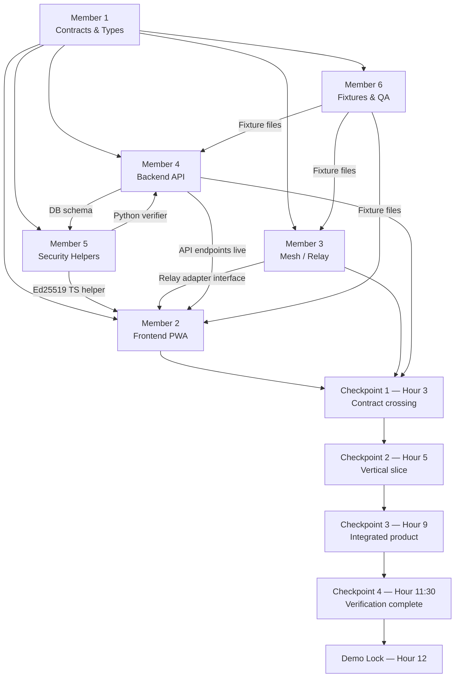

# ResQMesh — 6-Member Team Task Division

> **Reading order before you start:** Read [16_BUILD_CONTRACT.md](file:///C:/Users/saroj/Desktop/ResQMesh/docs/16_BUILD_CONTRACT.md) first (shared frozen spec), then [08_BUILD_PLAN_12_HOURS.md](file:///C:/Users/saroj/Desktop/ResQMesh/docs/08_BUILD_PLAN_12_HOURS.md) (phase timing), then only your own section below.

---

## 🗺️ Who Does What — At a Glance

| Member | Role | Folder / Files Owned |
|--------|------|----------------------|
| **Member 1** | Architecture & Integration Lead | `docs/`, `packages/fixtures/`, root config, cross-lane PRs |
| **Member 2** | Frontend / PWA (Client) | `apps/web/src/features/{sos,relay,responder,resources}/`, `apps/web/src/lib/{storage,crypto}/` |
| **Member 3** | Mesh / P2P Networking | `apps/web/src/lib/relay/`, bridge simulator |
| **Member 4** | Backend / Data (API + DB) | `apps/api/app/{routes,services,db}/`, `apps/api/app/{main.py,contracts.py}` |
| **Member 5** | Security, Reliability & Observability | Signature helpers, test suite, failure paths, logging |
| **Member 6** | QA, Demo & Accessibility | `packages/fixtures/`, seed/reset scripts, `docs/09_DEMO_SCRIPT.md`, evidence log |

---

## ⏱️ Execution Order (When to Do What)

```
Hour 0–1   → ALL MEMBERS: Phase 0 Alignment  (Member 1 leads)
Hour 1–3   → PARALLEL: Members 2, 3, 4, 5, 6 work in isolation
Hour 3     → CHECKPOINT 1: Contract connection (Member 1 validates crossing)
Hour 3–5   → PARALLEL: Vertical slice integration
Hour 5     → CHECKPOINT 2: Vertical slice demo (all lanes converge)
Hour 5–7   → PARALLEL: Coordination, trust, projections
Hour 7–9   → PARALLEL: UX polish, error states, accessibility
Hour 9     → CHECKPOINT 3: Integrated product gate
Hour 9–10:30 → Resilience & security re-runs (Member 5 leads)
Hour 10:30–11:30 → CHECKPOINT 4: Verification + evidence (Member 6 leads)
Hour 11:30–12 → Demo lock — Member 1 freezes scope, Member 6 runs script × 2
```

---

## 👤 Member 1 — Architecture & Integration Lead

> **Primary docs:** [16_BUILD_CONTRACT.md](file:///C:/Users/saroj/Desktop/ResQMesh/docs/16_BUILD_CONTRACT.md) · [08_BUILD_PLAN_12_HOURS.md](file:///C:/Users/saroj/Desktop/ResQMesh/docs/08_BUILD_PLAN_12_HOURS.md) · [13_CONTRIBUTING_AND_INTEGRATION.md](file:///C:/Users/saroj/Desktop/ResQMesh/docs/13_CONTRIBUTING_AND_INTEGRATION.md) · [11_DECISIONS.md](file:///C:/Users/saroj/Desktop/ResQMesh/docs/11_DECISIONS.md)

### Phase 0 (Hour 0–1) — Contract Freeze 🔒
- [x] ✅ Finalize and lock `docs/16_BUILD_CONTRACT.md` — enums, limits, envelope, state machine
- [x] ✅ Create the single canonical event type file (`packages/contracts/types.ts` + `apps/api/app/contracts.py`) so no one invents duplicate types
- [x] ✅ Freeze fixture IDs: `incident_id = demo-flood-2026`, geohash = `tdr1q0`
- [x] ✅ Write and share the ownership map + dependency graph with all 5 other members
- [x] ✅ Set up the project folder structure exactly as defined in [16_BUILD_CONTRACT.md §Fixed stack](file:///C:/Users/saroj/Desktop/ResQMesh/docs/16_BUILD_CONTRACT.md#L22-L31)
- [x] ✅ Create `infra/compose.yaml` with PostgreSQL 16 (no extensions) and any local dev services
- [x] ✅ Ensure one sample SOS fixture parses in all three layers (client, relay, API) — exit gate for Phase 0 *(verified in API/Python layer; client/relay layers depend on Members 2 & 3)*

### Phase 1–2 (Hour 1–5) — Integration Scaffolding
- [ ] ❌ Own merge authority: no lane merges to `main` without your review if it touches shared contracts *(blocked — waiting for other members' PRs)*
- [ ] ❌ Review and validate that Member 2's SOS form, Member 3's relay adapter, and Member 4's API all use the **same** `DeliveryState` enum — no duplicates *(blocked — waiting for Members 2, 3, 4 to submit)*
- [ ] ❌ Validate Checkpoint 1 (Hour 3): event fixture from client traverses relay interface into API validator without field name mismatches *(blocked — waiting for Members 2, 3, 4)*

### Phase 3–5 (Hour 5–9) — Cross-Lane Integration
- [x] ✅ Own `docs/11_DECISIONS.md` — log every cross-cutting architecture decision here
- [ ] ❌ Validate Checkpoint 2 (Hour 5): confirm full offline-to-bridge path works end-to-end *(blocked — waiting for Members 2, 3, 4)*
- [ ] ❌ Validate Checkpoint 3 (Hour 9): all core P0 features use real integrated behavior, no mocked UI state *(blocked — waiting for all members)*
- [x] ✅ Prepare architecture diagram for judges (partitioning, async projections, cache boundaries, regional federation path) — see [03_ARCHITECTURE_DESIGN.md §Billion-ready evolution](file:///C:/Users/saroj/Desktop/ResQMesh/docs/03_ARCHITECTURE_DESIGN.md#L51-L60)

### Phase 6–7 (Hour 10:30–12) — Demo Lock
- [ ] ❌ Freeze all feature work at Hour 11:30; only defect fixes accepted after *(not yet at this phase)*
- [x] ✅ Update `docs/15_REQUIREMENTS_TRACEABILITY.md` with actual `IMPLEMENTED` / `VERIFIED` / `DEFERRED` statuses
- [ ] ❌ Ensure no unverified scale claims remain in any slides or docs *(pending — needs final review at demo lock)*
- [x] ✅ Prepare the sixty-second scale proof response (see [16_BUILD_CONTRACT.md §Sixty-second scale proof](file:///C:/Users/saroj/Desktop/ResQMesh/docs/16_BUILD_CONTRACT.md#L194-L201))

**Branch prefix:** `arch/`

---

## 👤 Member 2 — Frontend / PWA (Client)

> **Primary docs:** [16_BUILD_CONTRACT.md](file:///C:/Users/saroj/Desktop/ResQMesh/docs/16_BUILD_CONTRACT.md) · [02_MASTER_SPEC.md §UI requirements](file:///C:/Users/saroj/Desktop/ResQMesh/docs/02_MASTER_SPEC.md#L111-L118) · [05_API_CONTRACT.md](file:///C:/Users/saroj/Desktop/ResQMesh/docs/05_API_CONTRACT.md) · [03_ARCHITECTURE_DESIGN.md §Client](file:///C:/Users/saroj/Desktop/ResQMesh/docs/03_ARCHITECTURE_DESIGN.md#L23-L26)

### Phase 1 (Hour 1–3) — Foundation
- [ ] **SOS Form** (`apps/web/src/features/sos/`):
  - [ ] Mobile-first form at 360 px viewport; SOS button visible without scroll
  - [ ] Fields: need category (`MEDICAL | RESCUE | FOOD_WATER | SHELTER`), priority (`CRITICAL | HIGH | NORMAL`), geohash location (6-char) — no free text name/phone
  - [ ] Confirmation step that summarizes payload before submit
  - [ ] Ed25519 key generation on first run — store private JWK in IndexedDB only (coordinate with Member 5)
  - [ ] Sign the envelope exactly per [16_BUILD_CONTRACT.md §Ed25519 signing rule](file:///C:/Users/saroj/Desktop/ResQMesh/docs/16_BUILD_CONTRACT.md#L98-L107)
- [ ] **IndexedDB Queue** (`apps/web/src/lib/storage/`):
  - [ ] Persist events to IndexedDB on submit (`SAVED_LOCAL`)
  - [ ] Queue survives browser refresh — write a persistence test (automated)
  - [ ] Implement delivery state transitions: `DRAFT → SAVED_LOCAL → QUEUED_FOR_RELAY`
- [ ] **Network/Status Bar** (`apps/web/src/features/relay/`):
  - [ ] Show `OFFLINE`, `RELAYING`, `BRIDGE_AVAILABLE`, `SYNCED`, `FAILED` — plain text, not color-only
  - [ ] Status must distinguish local-saved vs peer-acked vs bridge-confirmed vs server-synced

### Phase 2 (Hour 3–5) — Relay Integration
- [ ] Connect to Member 3's relay adapter — use the `EVENT_OFFER → EVENT_REQUEST → EVENT_PUSH → EVENT_ACK` flow
- [ ] Transition state to `PEER_ACKED` only on `ACCEPTED` or `DUPLICATE` ACK
- [ ] Transition state to `BRIDGE_ACKED` when bridge confirms receipt
- [ ] Transition state to `SYNCED` only when `POST /v1/events` returns canonical receipt
- [ ] Implement `RETRY_PENDING → QUEUED_FOR_RELAY` retry loop with backoff

### Phase 3 (Hour 5–7) — Responder & Resources UI
- [ ] **Responder Console** (`apps/web/src/features/responder/`):
  - [ ] Display incident events (cursor-paginated, no full-history download)
  - [ ] Show provenance panel: origin, signature state, relay hops, freshness, trust state (`UNVERIFIED | CORROBORATED | CONFLICTING | REJECTED`)
  - [ ] Confidence Decay UI: derive `confidence_pct` per [16_BUILD_CONTRACT.md §Confidence Decay formula](file:///C:/Users/saroj/Desktop/ResQMesh/docs/16_BUILD_CONTRACT.md#L165-L170); update once per second
  - [ ] Color/opacity thresholds: 80–94 = solid red; 60–79 = amber 0.72; <60 = dim red/gray 0.45
  - [ ] Demo simulated-clock control: `0m`, `10m`, `20m` buttons
  - [ ] Corroborate road observation button (responder action resets confidence)
- [ ] **Resources View** (`apps/web/src/features/resources/`):
  - [ ] Show candidate match list from `GET /v1/resources/matches?need_event_id=`
  - [ ] Display rationale array (factual, not AI score)
  - [ ] Assignment proposal/acceptance: only a responder can create an assignment

### Phase 4 (Hour 7–9) — UX Polish & Accessibility
- [ ] Every async action has: loading, success, empty, error, retry states
- [ ] Long lists paginate or virtualize — no full feed download
- [ ] Map is optional: locality/geohash text must work without Leaflet tiles
- [ ] Keyboard navigation works for the entire core journey
- [ ] 44 px touch targets; visible focus; status text not color-only
- [ ] Add `prefers-reduced-motion` support for confidence decay pulse (250 ms pulse → color/text only)
- [ ] Add explicit labels: "Prototype transport", "Synthetic data", "Planned capability" where applicable

**Branch prefix:** `client/`

---

## 👤 Member 3 — Mesh / P2P Networking

> **Primary docs:** [16_BUILD_CONTRACT.md §WebSocket frame contract](file:///C:/Users/saroj/Desktop/ResQMesh/docs/16_BUILD_CONTRACT.md#L120-L134) · [03_ARCHITECTURE_DESIGN.md §Mesh communication](file:///C:/Users/saroj/Desktop/ResQMesh/docs/03_ARCHITECTURE_DESIGN.md#L28-L31) · [05_API_CONTRACT.md §Transport contract](file:///C:/Users/saroj/Desktop/ResQMesh/docs/05_API_CONTRACT.md#L59-L62)

### Phase 1 (Hour 1–3) — Relay Core
- [ ] **WebSocket relay adapter** (`apps/web/src/lib/relay/`):
  - [ ] Implement all 7 frame types: `HELLO`, `EVENT_OFFER`, `EVENT_REQUEST`, `EVENT_PUSH`, `EVENT_ACK`, `PING`, `PONG`
  - [ ] Every frame must carry: `frame_type`, `protocol_version: 1`, `frame_id` (UUID v4), `sent_at` (UTC ISO-8601)
  - [ ] Reject frames > `MAX_FRAME_BYTES = 3072` **before** parsing envelope
  - [ ] Maintain max `MAX_ACTIVE_PEERS = 4` connections
- [ ] **Duplicate suppression cache:**
  - [ ] Store up to `MAX_DEDUPE_IDS = 1024` event IDs
  - [ ] Suppress forwarding if event_id already seen
- [ ] **TTL enforcement:**
  - [ ] Reject forwarding if `ttl_seconds` has elapsed since `created_at`
  - [ ] `MIN_TTL_SECONDS = 60`, `DEFAULT_TTL_SECONDS = 1800`, `MAX_TTL_SECONDS = 3600`
- [ ] **Hop count enforcement:** never forward when `hop_count >= MAX_HOPS (= 3)` — even if TTL remains. `hop_count` is a relay frame field, never a signed envelope field.

### Phase 2 (Hour 3–5) — Bridge Simulator
- [ ] **Bridge simulator** (simulated rescue vehicle):
  - [ ] Acts as a relay peer that also has HTTP connectivity to the backend
  - [ ] On receiving a valid event via relay, calls `POST /v1/events` idempotently
  - [ ] Implements `POST /v1/sync/pull` + `POST /v1/sync/ack` loop (cursor-based, page ≤ 50 events or 100 KB)
  - [ ] Transitions event state to `BRIDGE_ACKED` on its own receipt; waits for API `201` to signal `SYNCED`
- [ ] **Two simulated peers** for local development/demo: Phone A (origin), Phone B (relay hop), Bridge (bridge node)
- [ ] Validate: two duplicate relays from same event_id → only one canonical event at API

### Phase 3 (Hour 5–7) — Robustness
- [ ] `PEER_ACKED` state is only reached on `ACCEPTED` or `DUPLICATE` ACK — verify with Member 2
- [ ] Implement priority scheduling: `CRITICAL` events get forwarding priority over `NORMAL`
- [ ] Per-peer and per-origin token-bucket quotas (backpressure — see [03_ARCHITECTURE_DESIGN.md §Backpressure](file:///C:/Users/saroj/Desktop/ResQMesh/docs/03_ARCHITECTURE_DESIGN.md#L97-L100))
- [ ] Emit structured telemetry: relay receipt, duplicate suppression, TTL expiry, rejection — no plaintext sensitive data

### Phase 5 (Hour 9–10:30) — Resilience Tests
- [ ] Run: duplicate relay test (two copies → one canonical), TTL expiry test (expired event not forwarded)
- [ ] Run: `hop_count = 3` boundary test (not forwarded on 4th hop)
- [ ] Run: malformed frame / oversized frame rejection
- [ ] Demo scale proof: 50 duplicate Region A copies while Region B SOS created → Region A = 1 canonical, Region B completes

**Branch prefix:** `mesh/`

---

## 👤 Member 4 — Backend / Data (API + Database)

> **Primary docs:** [16_BUILD_CONTRACT.md §P0 HTTP endpoints](file:///C:/Users/saroj/Desktop/ResQMesh/docs/16_BUILD_CONTRACT.md#L176-L192) · [05_API_CONTRACT.md](file:///C:/Users/saroj/Desktop/ResQMesh/docs/05_API_CONTRACT.md) · [16_BUILD_CONTRACT.md §Storage schema](file:///C:/Users/saroj/Desktop/ResQMesh/docs/16_BUILD_CONTRACT.md#L136-L153) · [02_MASTER_SPEC.md §Domain model](file:///C:/Users/saroj/Desktop/ResQMesh/docs/02_MASTER_SPEC.md#L51-L62)

### Phase 1 (Hour 1–3) — API Skeleton + DB
- [ ] **FastAPI skeleton** (`apps/api/app/main.py`):
  - [ ] Health endpoint: `GET /healthz`
  - [ ] Typed Pydantic v2 models for all event types in `apps/api/app/contracts.py` — use enums from [16_BUILD_CONTRACT.md](file:///C:/Users/saroj/Desktop/ResQMesh/docs/16_BUILD_CONTRACT.md#L36-L68)
  - [ ] Request validation order exactly as per [05_API_CONTRACT.md §Request validation order](file:///C:/Users/saroj/Desktop/ResQMesh/docs/05_API_CONTRACT.md#L67-L76): size → schema → auth → idempotency → signature → persist → async project
- [ ] **PostgreSQL 16 schema** (via Alembic migration):
  - [ ] `events` table with all columns and indexes
  - [ ] `resources` table
  - [ ] `assignments` table with FK references
  - [ ] Indexes: `(incident_id, created_at desc)` and `(incident_id, region_geohash, type)` on events; `(incident_id, capability, status, observed_at desc)` on resources
  - [ ] PostgreSQL 16 only — no PostGIS, no Neo4j, no SQLite substitution
- [ ] Seed deterministic synthetic incident: `incident_id = demo-flood-2026`, one medical SOS, ambulance resource, hospital bed resource, two conflicting road reports

### Phase 2 (Hour 3–5) — Core Endpoints
- [ ] `POST /v1/events`:
  - [ ] Returns `201` for new canonical event, `200` for byte-identical replay, `409 EVENT_ID_CONFLICT` for changed bytes on same ID
  - [ ] Requires `Idempotency-Key` header
  - [ ] Ed25519 signature verification (use Member 5's Python verifier)
  - [ ] Reject unknown body fields
  - [ ] Return receipt with `request_id`
- [ ] `GET /v1/incidents/{incident_id}/events` — cursor-paginated, returns `as_of` time
- [ ] `POST /v1/sync/pull` and `POST /v1/sync/ack` — bridge sync endpoints

### Phase 3 (Hour 5–7) — Matching & Trust Projection
- [ ] `POST /v1/resources` — register/update resource with `observed_at`
- [ ] `GET /v1/resources/matches?need_event_id=`:
  - [ ] Deterministic match rule: capability → status AVAILABLE → available_units > 0 → first 4 geohash chars match → observed_at ≤ 15 min
  - [ ] Capability mapping: `MEDICAL→AMBULANCE,HOSPITAL_BED`; `SHELTER→SHELTER_BED`; `FOOD_WATER→FOOD_WATER`; `RESCUE→AMBULANCE`
  - [ ] Sort: exact geohash → capability order → newest observation → stable resource_id
  - [ ] Return max 3 candidates with `rationale[]` array
- [ ] Trust classification: same subject + first-4-char region + within 30 min → `CONFLICTING` or `CORROBORATED`; else `UNVERIFIED`
- [ ] `POST /v1/reports/{id}/corroborations` — add evidence without overwriting
- [ ] `POST /v1/assignments` — responder role required; fails for unavailable/stale resource
- [ ] `PATCH /v1/assignments/{assignment_id}` — update state/reason/time

### Phase 4 (Hour 7–9) — Error Contract + Config
- [ ] Return exact error shape: `{ code, message, request_id, retryable, details? }` for all error codes in [05_API_CONTRACT.md §Error contract](file:///C:/Users/saroj/Desktop/ResQMesh/docs/05_API_CONTRACT.md#L79-L101)
- [ ] Typed configuration validator that fails safely at startup
- [ ] Emit structured telemetry per event (queue age, relay receipt, duplicate suppression, API receipt, projection lag)
- [ ] CAP/GeoJSON endpoints (`GET /v1/interop/cap/{id}`, `POST /v1/interop/geojson`) — only if all above are complete

**Branch prefix:** `backend/`

---

## 👤 Member 5 — Security, Reliability & Observability

> **Primary docs:** [16_BUILD_CONTRACT.md §Ed25519 signing rule](file:///C:/Users/saroj/Desktop/ResQMesh/docs/16_BUILD_CONTRACT.md#L98-L107) · [12_RELIABILITY_AND_RUNBOOKS.md](file:///C:/Users/saroj/Desktop/ResQMesh/docs/12_RELIABILITY_AND_RUNBOOKS.md) · [04_DATA_AND_PRIVACY.md](file:///C:/Users/saroj/Desktop/ResQMesh/docs/04_DATA_AND_PRIVACY.md) · [02_MASTER_SPEC.md §Quality attributes](file:///C:/Users/saroj/Desktop/ResQMesh/docs/02_MASTER_SPEC.md#L120-L130)

### Phase 1 (Hour 1–3) — Cryptographic Helpers + Rejection Fixtures
- [ ] **Ed25519 signing helper** (TypeScript — Web Crypto API) for Member 2 to use:
  - [ ] Generate key pair on first run; store private JWK only in IndexedDB
  - [ ] `key_id = "demo:" + first 16 lowercase hex chars of SHA-256(raw public key)`
  - [ ] Canonical JSON: sort object keys by Unicode code point; no floats; no whitespace; prefix `resqmesh/v1\n`; sign with Ed25519; output unpadded base64url
- [ ] **Ed25519 Python verifier** (`apps/api/app/`) for Member 4 to import:
  - [ ] Mirror exact same canonicalization
  - [ ] Label citizen keys `UNVERIFIED` (integrity proven, identity is not)
  - [ ] Reject `SIGNATURE_INVALID` / `KEY_REVOKED` — these must not enter projection
- [ ] Create rejection test fixtures (coordinate with Member 6):
  - [ ] `sos.bad-signature.json` — mutated signed field
  - [ ] Expired TTL fixture
  - [ ] Oversized payload fixture (> 2048 bytes)

### Phase 2 (Hour 3–5) — Rate Limits & Backpressure
- [ ] Enforce at API: max request size, event-type allowlist, TTL cap, per-origin rate limits
- [ ] `MAX_QUEUE_EVENTS = 200` in client IndexedDB queue
- [ ] `429 RATE_LIMITED` and `QUEUE_LIMITED` responses include retry metadata
- [ ] Relay-layer backpressure (coordinate with Member 3): token-bucket quotas per peer
- [ ] CRITICAL SOS always gets an explicit local outcome even under backpressure

### Phase 3 (Hour 5–7) — Failure Test Suite
- [ ] Automated tests for all failure scenarios:
  - [ ] Offline refresh: SOS remains in IndexedDB as `SAVED_LOCAL` after page reload
  - [ ] Duplicate relay: same event_id sent twice → one canonical event in DB
  - [ ] TTL expiry: `410 EVENT_TTL_EXPIRED`, not forwarded
  - [ ] Bad signature: `422 SIGNATURE_INVALID`, not projected
  - [ ] API outage + retry: no event loss, no request storm
  - [ ] Stale resource: `observed_at` > 15 min → not in match candidates
  - [ ] Conflicting road: two keys, different conditions → `CONFLICTING`
  - [ ] Canonicalization parity: client-signed fixture verified by Python side

### Phase 4 (Hour 7–9) — Observability
- [ ] Privacy-minimized structured logs: queue age, relay receipt, duplicate suppression, API receipt, projection lag
- [ ] No plaintext sensitive data (exact location, phone, name) in any log label
- [ ] Internal stack traces never in client error responses
- [ ] `REJECTED` is the terminal state for any validation failure

### Phase 5 (Hour 9–10:30) — Resilience Re-run
- [ ] Re-run all failure tests from Phase 3 against the integrated system
- [ ] Verify Confidence Decay: at `20m` → ~60%; after responder corroboration → resets to 94%
- [ ] Validate no uncontrolled polling and no full incident-history fetch from client
- [ ] Document known limits in [12_RELIABILITY_AND_RUNBOOKS.md](file:///C:/Users/saroj/Desktop/ResQMesh/docs/12_RELIABILITY_AND_RUNBOOKS.md)

**Branch prefix:** `security/`

---

## 👤 Member 6 — QA, Demo & Accessibility

> **Primary docs:** [09_DEMO_SCRIPT.md](file:///C:/Users/saroj/Desktop/ResQMesh/docs/09_DEMO_SCRIPT.md) · [07_EVALUATION_PLAN.md](file:///C:/Users/saroj/Desktop/ResQMesh/docs/07_EVALUATION_PLAN.md) · [10_JUDGE_QA.md](file:///C:/Users/saroj/Desktop/ResQMesh/docs/10_JUDGE_QA.md) · [16_BUILD_CONTRACT.md §Required fixtures](file:///C:/Users/saroj/Desktop/ResQMesh/docs/16_BUILD_CONTRACT.md#L192)

### Phase 0 (Hour 0–1) — Demo Plan
- [ ] Read [09_DEMO_SCRIPT.md](file:///C:/Users/saroj/Desktop/ResQMesh/docs/09_DEMO_SCRIPT.md) and [10_JUDGE_QA.md](file:///C:/Users/saroj/Desktop/ResQMesh/docs/10_JUDGE_QA.md) end to end
- [ ] Define the exact 5-minute demo journey and share with all members
- [ ] Identify which demo moment provides evidence for each judging criterion: Impact, Feasibility, Innovation, UX

### Phase 1 (Hour 1–3) — Fixture Creation
- [ ] `packages/fixtures/sos.valid.json` — generated with test Ed25519 key, verifiable by web/API tests
- [ ] `packages/fixtures/sos.bad-signature.json` — mutated signed field (coordinate with Member 5)
- [ ] `packages/fixtures/incident.demo.json`:
  - `incident_id = demo-flood-2026`; geohash `tdr1q0`
  - One medical SOS (CRITICAL priority)
  - One ambulance resource (AVAILABLE, `available_units > 0`)
  - One hospital bed resource (AVAILABLE)
  - Two conflicting road reports (same subject, different conditions, different `origin.key_id` values)
- [ ] **Reset/seed script**: restores DB + IndexedDB to deterministic state in < 30 seconds
- [ ] Verify CI validates fixtures through Pydantic + TypeScript type checks

### Phase 2–3 (Hour 3–7) — Acceptance Checklist
- [ ] Maintain running checklist (update as each lane delivers):
  - [ ] SOS persists after refresh (FR-01 durability)
  - [ ] Duplicate relay → one canonical event (FR-07 idempotency)
  - [ ] Bad signature rejected (FR-02 safety)
  - [ ] Core journey works keyboard-only (accessibility)
  - [ ] No full-feed download triggered (performance)
  - [ ] Failure path creates structured log (observability)
- [ ] Accessibility walkthrough:
  - [ ] Tab through SOS form → submit → status update — all keyboard
  - [ ] 360 px viewport: SOS button visible without scroll
  - [ ] Status text not color-only; visible focus rings
  - [ ] Screen reader labels on all interactive controls
  - [ ] `prefers-reduced-motion` tested

### Phase 4 (Hour 7–9) — Evidence Capture
- [ ] Screenshots: SOS form, each delivery state, confidence decay at 0m/10m/20m, resource match + rationale, provenance panel, conflict trust state, assignment acceptance
- [ ] Network samples: valid SOS `201`, duplicate `200`, expired TTL `410`, bad signature `422`
- [ ] Log capture: queue age, relay receipt, duplicate suppression

### Phase 6 (Hour 10:30–11:30) — Verification Complete
- [ ] Run full integration suite from [07_EVALUATION_PLAN.md](file:///C:/Users/saroj/Desktop/ResQMesh/docs/07_EVALUATION_PLAN.md)
- [ ] Rehearse 5-minute demo script once with full team
- [ ] Update [15_REQUIREMENTS_TRACEABILITY.md](file:///C:/Users/saroj/Desktop/ResQMesh/docs/15_REQUIREMENTS_TRACEABILITY.md) with `IMPLEMENTED` / `VERIFIED` / `DEFERRED` for FR-01 through FR-08
- [ ] Confirm backup recording ready as fallback
- [ ] Two consecutive successful demo walkthroughs on final device

### Phase 7 (Hour 11:30–12) — Demo Lock
- [ ] Reset fixtures between the two final runs
- [ ] Prepare factual judge answers from [10_JUDGE_QA.md](file:///C:/Users/saroj/Desktop/ResQMesh/docs/10_JUDGE_QA.md)
- [ ] Capture evidence register: build version, test results, screenshots, known limits
- [ ] Confirm backup recording playback works

**Branch prefix:** `qa/`

---

## 🔗 Integration Dependency Order



---

## 📋 Integration Handoff Protocol (Mandatory at Each Checkpoint)

Each member posts at each checkpoint:

| Field | What to write |
|-------|--------------|
| Completed task IDs | Which checklist items above are ✅ done |
| Changed contracts | Any shared type / endpoint / enum changed |
| Verification evidence | Screenshot, log, or test output link |
| Current blocker | What is blocking you right now |
| Next dependency | What you need from another member |
| Golden path status | Can the demo end-to-end still run? Yes / No / Partially |

> [!IMPORTANT]
> No phase is complete just because code was written. Evidence is required.

---

## 🚫 Scope Brakes — What NOT to Build in 12 Hours

| Deferred item | Why | Mark as in UI |
|---------------|-----|---------------|
| Native BLE / Wi-Fi Direct | WebSocket is sufficient for P0 | "Planned capability" |
| Neo4j / PostGIS / pgRouting | PostgreSQL 16 + geohash is P0 | Not in DB |
| Live AI inference | Rule-based match is P0 | "Suggested from this report" stub only |
| Full map routing | Geohash locality text is sufficient | Map is progressive enhancement |
| Multi-region deployment | Architecture diagram covers it | Not deployed |
| Attachments / media in SOS | Deferred from emergency envelope | Not in schema |
| Authentication UI | Anonymous SOS is P0 | Role enforced server-side only |

---

## 📁 Document Reference Map

| Document | Who reads it |
|----------|-------------|
| [16_BUILD_CONTRACT.md](file:///C:/Users/saroj/Desktop/ResQMesh/docs/16_BUILD_CONTRACT.md) | **ALL** — before writing any code |
| [08_BUILD_PLAN_12_HOURS.md](file:///C:/Users/saroj/Desktop/ResQMesh/docs/08_BUILD_PLAN_12_HOURS.md) | **ALL** — phase timing and exit gates |
| [02_MASTER_SPEC.md](file:///C:/Users/saroj/Desktop/ResQMesh/docs/02_MASTER_SPEC.md) | M1, M2, M4 — domain model, functional requirements, state machines |
| [05_API_CONTRACT.md](file:///C:/Users/saroj/Desktop/ResQMesh/docs/05_API_CONTRACT.md) | M2, M3, M4, M5 — endpoint shapes, error codes, sync protocol |
| [03_ARCHITECTURE_DESIGN.md](file:///C:/Users/saroj/Desktop/ResQMesh/docs/03_ARCHITECTURE_DESIGN.md) | M1, M3, M4 — component responsibilities, failure containment |
| [06_AI_DESIGN.md](file:///C:/Users/saroj/Desktop/ResQMesh/docs/06_AI_DESIGN.md) | M4 (stub only) — AI is optional, rule-first is mandatory |
| [04_DATA_AND_PRIVACY.md](file:///C:/Users/saroj/Desktop/ResQMesh/docs/04_DATA_AND_PRIVACY.md) | M5, M4 — privacy rules for logs/fixtures |
| [07_EVALUATION_PLAN.md](file:///C:/Users/saroj/Desktop/ResQMesh/docs/07_EVALUATION_PLAN.md) | M6 — acceptance criteria and test plan |
| [09_DEMO_SCRIPT.md](file:///C:/Users/saroj/Desktop/ResQMesh/docs/09_DEMO_SCRIPT.md) | M6 — 5-minute demo journey |
| [10_JUDGE_QA.md](file:///C:/Users/saroj/Desktop/ResQMesh/docs/10_JUDGE_QA.md) | M6, M1 — judge question preparation |
| [12_RELIABILITY_AND_RUNBOOKS.md](file:///C:/Users/saroj/Desktop/ResQMesh/docs/12_RELIABILITY_AND_RUNBOOKS.md) | M5 — failure runbooks |
| [13_CONTRIBUTING_AND_INTEGRATION.md](file:///C:/Users/saroj/Desktop/ResQMesh/docs/13_CONTRIBUTING_AND_INTEGRATION.md) | **ALL** — branch naming, PR rules, definition of done |
| [15_REQUIREMENTS_TRACEABILITY.md](file:///C:/Users/saroj/Desktop/ResQMesh/docs/15_REQUIREMENTS_TRACEABILITY.md) | M1, M6 — update at Checkpoint 4 |
| [11_DECISIONS.md](file:///C:/Users/saroj/Desktop/ResQMesh/docs/11_DECISIONS.md) | M1 — ADR log for all cross-cutting decisions |
